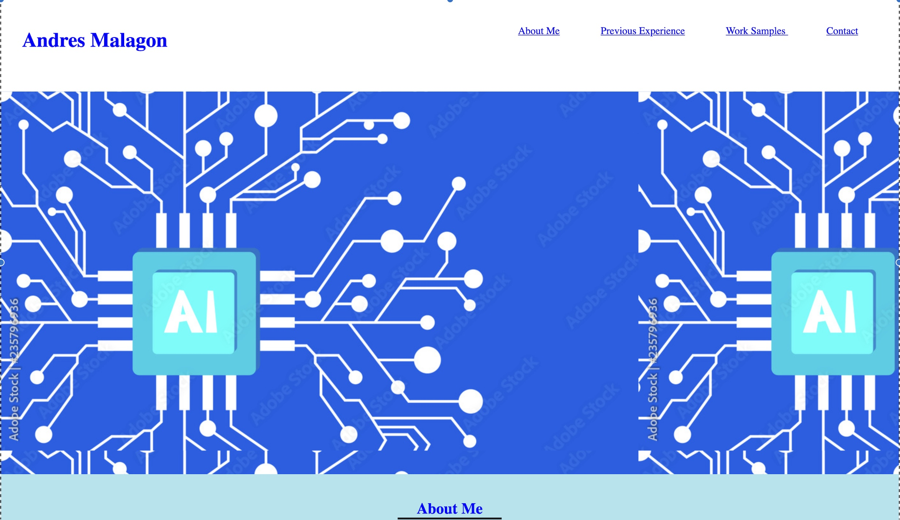

# portfolio

This project is the first version of my professional portfolio. It is a single scrollable page that contains a nav bar, a hero image, an "about me" section, a "previous experience" section, a "work samples" secion, and "contact" section. Within the "work samples" section, I have included two clickable images that link to projects I have worked on within the course. 

website link: <https://amalagon1.github.io/portfolio/>

